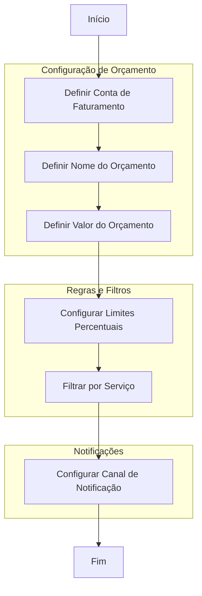
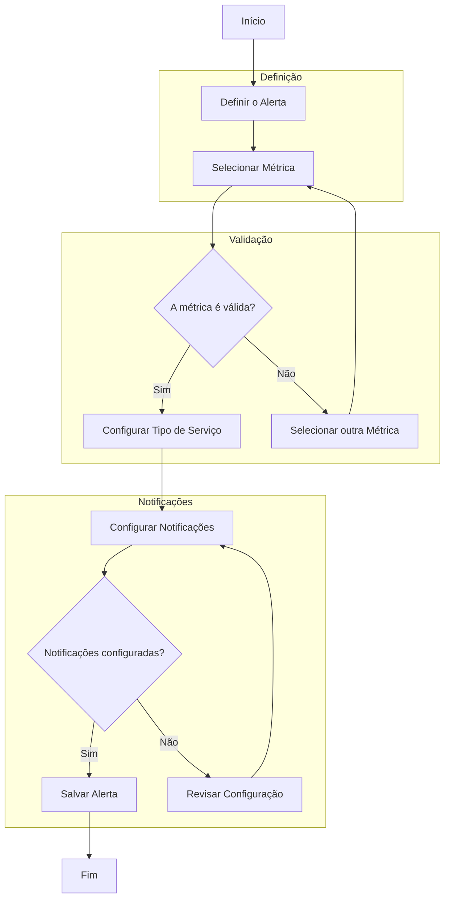

# Alertas para custos e por bytes processados por serviços

**Módulos:**  
1. **Definição**

2. **Alerta por custos de serviços**

3. **Alerta por bytes processados por serviços**

4. **Conclusão**

## Definição

Este documento descreve o processo de criação de dois tipos de alertas no Google Cloud: alertas por custos de serviços e alertas por bytes processados. Ambos requerem uma configuração específica para monitorar as métricas desejadas, com diferenças nos parâmetros e condições de cada um. Seguindo as etapas descritas, você será capaz de configurar alertas que monitoram os custos e o volume de dados processados, permitindo uma melhor gestão dos recursos.

## Alerta por custos de serviços

Os alertas de custos permitem monitorar o faturamento de um projeto, ativando notificações quando o custo atinge percentuais pré-definidos. Seguem as etapas necessárias para configurar este tipo de alerta:

### Etapas:

Configuração de Orçamento: Defina a conta de faturamento, o nome do orçamento e o valor máximo permitido.

Regras e Filtros: Configure limites percentuais para notificações e filtre por serviço, se necessário.

Configuração de Notificações: Selecione os canais de notificação, como e-mail ou SMS, para receber os alertas.

Essa configuração permite monitorar os custos acumulados e acionar notificações ao atingir certos percentuais, ajudando a prevenir estouros no orçamento.

## Alerta por bytes processados por serviços

Os alertas de bytes processados monitoram o volume de dados ingeridos por serviços, oferecendo maior flexibilidade na configuração e notificações personalizadas. O processo segue as etapas abaixo:

### Etapas:
Definição: Selecione a métrica de bytes a ser monitorada e defina o comportamento do alerta.

Validação: Verifique se a métrica é válida e ajuste o serviço ou métrica, se necessário.

Configuração de Notificações: Configure as notificações, especificando canais e intervalos de alerta.

Finalização: Salve e ative o alerta para monitorar o processamento de dados.

Com essas configurações, você poderá acompanhar o volume de dados processados por serviços específicos e ser notificado em eventos importantes.

## Conclusão

A criação de alertas para monitoramento de custos e bytes processados nos serviços em nuvem é uma prática fundamental para garantir a eficiência e o controle operacional. Esses alertas permitem que você:

Monitorar o orçamento de forma ativa: Com alertas configurados para custos, é possível acompanhar os gastos em tempo real e receber notificações antes que os limites sejam ultrapassados. Isso ajuda a evitar surpresas desagradáveis no faturamento e permite ajustes rápidos para otimizar o uso dos recursos.

Controlar o consumo de dados: Ao monitorar o volume de bytes processados por serviços, é possível identificar picos anômalos de uso de dados, o que pode indicar problemas de performance, necessidade de escalabilidade ou até mesmo falhas de configuração. Esses alertas facilitam a identificação de gargalos e pontos críticos em aplicações que dependem de grandes volumes de dados.

Personalizar notificações: A flexibilidade de configuração dos alertas permite que as notificações sejam personalizadas de acordo com os requisitos de sua equipe, enviando alertas para os canais mais adequados (e-mail, SMS, ou sistemas de notificação interna). Isso assegura que as informações cruciais cheguem às pessoas certas no momento certo.

Aprimorar a tomada de decisões: Ao acompanhar de perto os custos e o uso de dados, você tem uma visão mais clara sobre o comportamento dos serviços em nuvem. Isso permite ajustar orçamentos, escalar recursos de forma mais eficaz e otimizar o desempenho de suas aplicações, melhorando a eficiência geral da operação.

Prevenir problemas antes que se tornem críticos: A proatividade dos alertas permite agir antes que problemas se tornem críticos, como o estouro de orçamentos ou a sobrecarga de sistemas. Isso resulta em menor tempo de inatividade, redução de custos operacionais, e uma maior confiança na infraestrutura de nuvem.

Em resumo, com essas configurações de alertas você garante maior controle sobre os serviços e recursos, minimiza riscos financeiros e operacionais, e otimiza o uso das ferramentas de monitoramento para proporcionar um ambiente de trabalho mais eficiente e seguro.