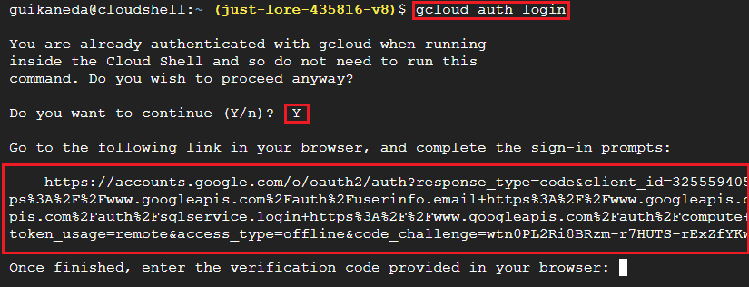
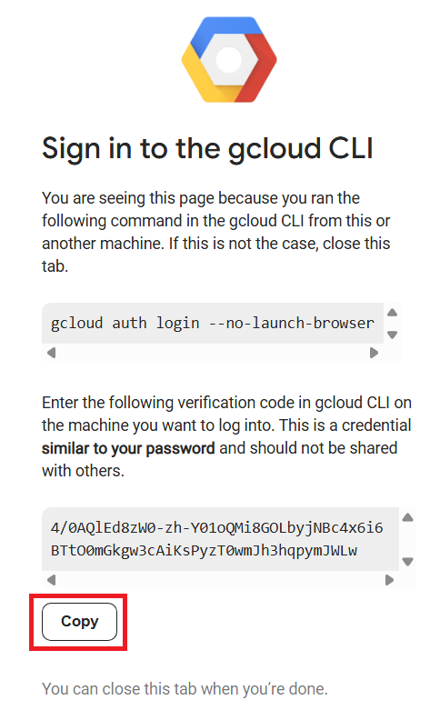
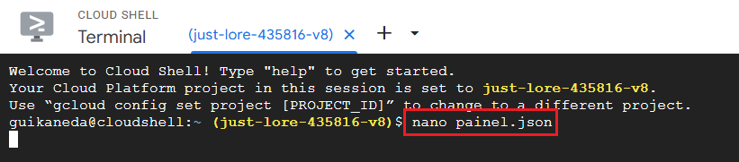
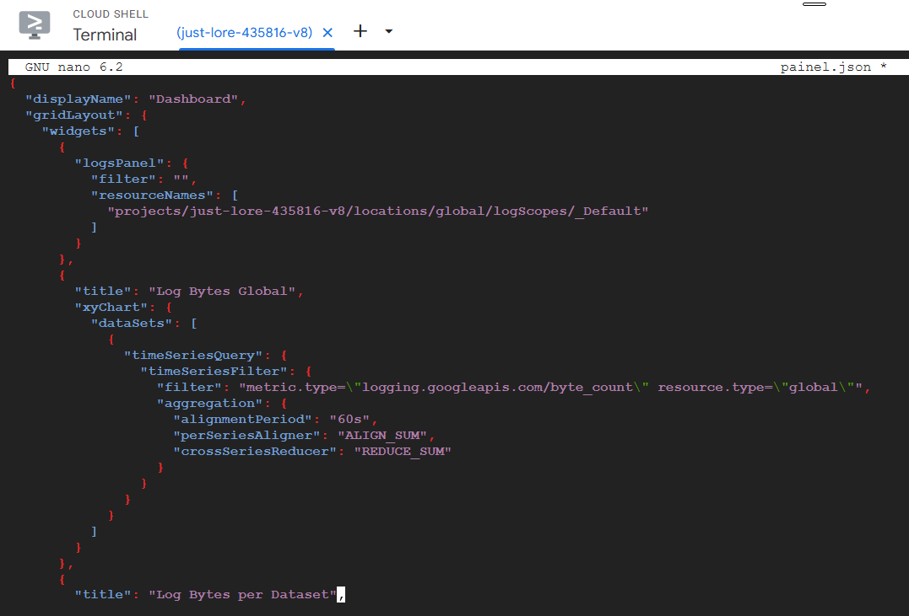
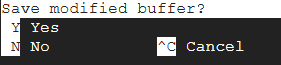
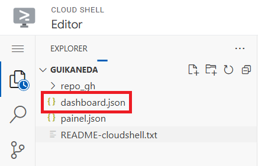
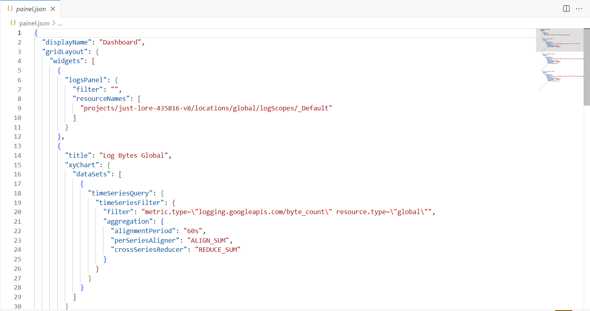

# Monitoramento pelo Cloud Shell

**Módulos:**  
1. **Definição**
2. **Autorização do Cloud Shell**
3. **Configuração do JSON**
4. **Execução do JSON** 

## Definição

Quando acessado via Cloud Shell, é possível facilmente integrar e configurar alertas, criar dashboards personalizados e monitorar métricas em tempo real do Cloud Monitoring, tudo dentro de um arquivo JSON configurável.

## Autorização do Cloud Shell

Dentro do Cloud Shell, primeiro devemos obter a autorização através do comando:

`gcloud auth login`

Quando executado, confirmamos o comando e entramos no link gerado.



Autorizamos e confirmamos GCloud CLI em nosso e-mail.

Na página redirecionada, copiamos a chave gerada.



E colamos no espaço do Cloud Shell.


## Configuração do JSON

Devemos criar um arquivo JSON para a configuração do dashboard. 

Podemos fazer de duas formas:

### Terminal

No terminal, executamos o comando `nano`.



Assim, abriremos o modo de edição do arquivo.



Em nosso caso, o JSON criará um dashboard com 4 painéis, que mostram o uso de bytes pelos Logs por dataset, rotina e global. 

Para isso usaremos o seguinte código:

```
{
  "displayName": "Teste",
  "gridLayout": {
    "widgets": [
      {
        "logsPanel": {
          "filter": "",
          "resourceNames": [
            "projects/just-lore-435816-v8/locations/global/logScopes/_Default"
          ]
        }
      },
      {
        "title": "Log Bytes Global",
        "xyChart": {
          "dataSets": [
            {
              "timeSeriesQuery": {
                "timeSeriesFilter": {
                  "filter": "metric.type=\"logging.googleapis.com/byte_count\" resource.type=\"global\"",
                  "aggregation": {
                    "alignmentPeriod": "60s",
                    "perSeriesAligner": "ALIGN_SUM",
                    "crossSeriesReducer": "REDUCE_SUM"
                  }
                }
              }
            }
          ]
        }
      },
      {
        "title": "Log Bytes per Dataset",
        "xyChart": {
          "dataSets": [
            {
              "timeSeriesQuery": {
                "timeSeriesFilter": {
                  "filter": "metric.type=\"logging.googleapis.com/byte_count\" resource.type=\"bigquery_dataset\"",
                  "aggregation": {
                    "alignmentPeriod": "60s",
                    "perSeriesAligner": "ALIGN_SUM",
                    "crossSeriesReducer": "REDUCE_SUM",
                    "groupByFields": [
                      "resource.label.dataset_id"
                    ]
                  }
                }
              }
            }
          ]
        }
      },
      {
        "title": "Log Bytes per Rotine",
        "xyChart": {
          "dataSets": [
            {
              "timeSeriesQuery": {
                "timeSeriesFilter": {
                  "filter": "metric.type=\"logging.googleapis.com/byte_count\" resource.type=\"dataform.googleapis.com/Repository\"",
                  "aggregation": {
                    "alignmentPeriod": "60s",
                    "perSeriesAligner": "ALIGN_SUM",
                    "crossSeriesReducer": "REDUCE_SUM",
                    "groupByFields": [
                      "resource.label.repository_id"
                    ]
                  }
                }
              }
            }
          ]
        }
      }
    ]
  }
}
```

Para mais informações sobre a estrutura do JSON: [Documentação](https://cloud.google.com/monitoring/dashboards/api-examples?hl=pt-br)

Uma vez adicionado o código no terminal, devemos salvar o arquivo com CTRL + X e confirmar com Y.



### Editor

O editor é um réplica do VSCode no Cloud Shell. Nele, podemos editar, adicionar e excluir arquivos e repositórios com mais facilidade.

Criaremos um arquivo JSON na pasta local.



Adicionaremos o mesmo código do JSON feito no terminal.



No editor, o salvamento é automático.

## Execução do JSON

Criado e configurado o JSON, devemos executa-ló com o comando:

`gcloud monitoring dashboards create --config-from-file=painel.json`

Quando executado uma mensagem de confirmação é mostrada no terminal.

Pronto, um novo dashboard com os painéis configurados estarão no Cloud Monitoring.