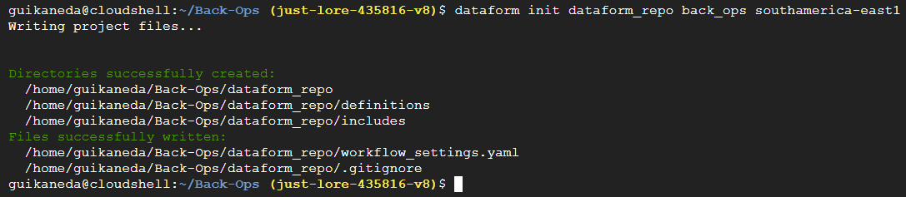

# Rotina pelo Cloud Shell

**Módulos:**  
1. **Definição**
2. **Clonagem do repositório remoto**
3. **Inicialização de um repositório do DataForm**
4. **Criação dos arquivos SQLX** 
5. **Criação de um repositório do DataForm**

## Definição

No Cloud Shell, é possível enviar códigos SQLX para um repositório no GitHub e, em seguida, conectá-lo a um repositório do DataForm para realizar o envio dos códigos.

## Clonagem do repositório remoto

Dentro do Cloud Shell, configuramos o `user name` e `user email` do Git com o comando:

```
git config --global user.name "Seu Nome"
git config --global user.email "seuemail@exemplo.com"
```


Feito isso, é possível clonar o repositório remoto que iremos alterar.

`git clone https://github.com/usuario/repo.git`


O clone do repositório ficará localizado na pasta local do Cloud Shell, ou seja, podemos usar o comando `cd` para entrar.

## Inicialização de um repositório do DataForm

Primeiro, baixaremos o CLI do DataForm.

`npm i -g @dataform/cli@^3.0.0-beta`


Agora é possível criar um repositório padrão do DataForm dentro do repositório clonado.

Executaremos o seguinte comando:

`dataform init dataform_repo back_ops southamerica-east1`



## Criação dos arquivos SQLX

Entramos na pasta definitions do repositório criado.

Aqui, criaremos os códigos SQLX desejados para a rotina. Para isso, usamos o comando `nano`.


Salvamos o arquivo com CTRL + X e confirmarmos com Y.

Uma vez adicionados os arquivos, podemos realizar o commit das alterações no repositório remoto. 

Voltamos para a pasta com `cd`. E executamos os comandos do fluxo básico do Git.

```
git add .
git commit -m "initial commit"
git push
```

Porém, quando executamos o push, será solicitado um username e senha.


A escolha do username não tem importância, mas a senha precisa ser um token do GitHub com acesso aos repositórios.

### Token GitHub

Para isso, dentro das configurações do perfil do GitHub, entramos na aba "Developer settings".


Depois, no token classic.


Aqui, escolheremos criar um novo token classico.


Em suas especificações, selecionamos a "repo", para dar acesso total aos repositórios.


Feito isso, podemos criar o token e copiar sua chave.

Quando colado no Cloud Shell, o `git push` será executado.


## Criação de um repositório do DataForm

Agora, criaremos um repositório no DataForm e o conectaremos com o GitHub, para puxar os códigos enviados pelo Cloud Shell.

Dentro do BigQuery, devemos entrar na aba do DataForm.


Uma vez dentro dele, criamos um repositório.


Na aba "settings", conectamos o repositório com o Git.


Nas configurações dessa conexão, especificamos o repositório do GitHub, a branch e o Secret.

Em nosso caso, já criamos um Secret.


Pronto, agora só precisamos criar um espaço de trabalho e todo conteúdo da branch do repositório indicado estará ali.

