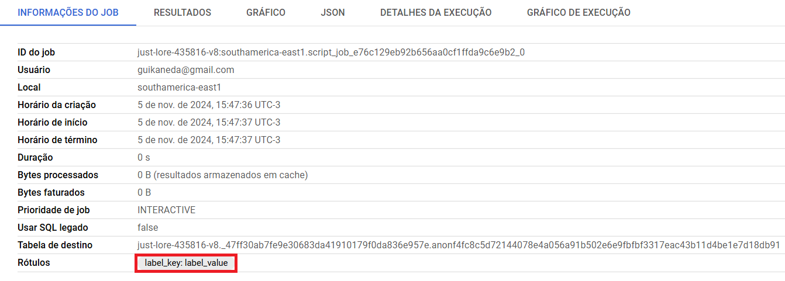
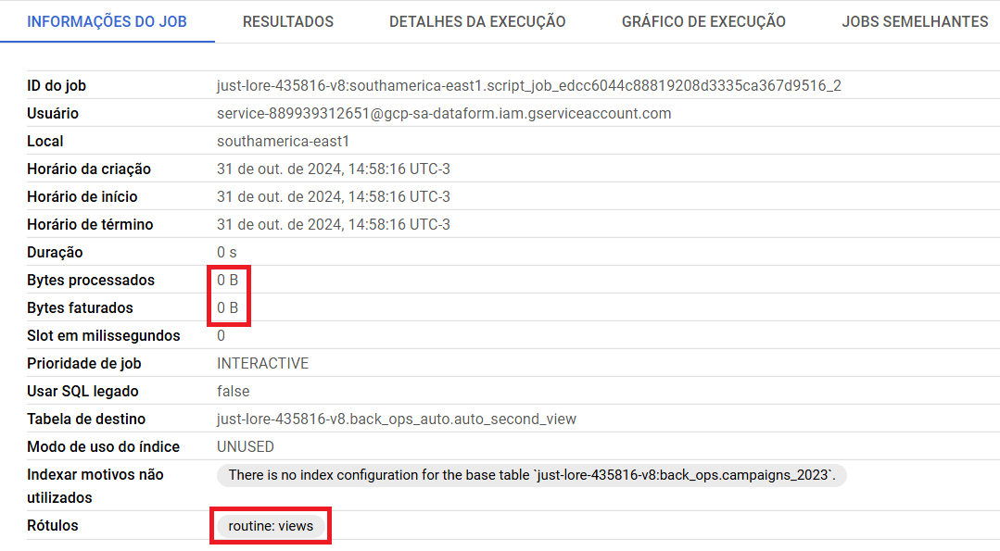

# Rótulo de jobs

**Módulos:**  
1. **Definição**
2. **Adicionar rótulos**
3. **Adição da coluna rotina**

## Definição

É possível adicionar um rótulo a um job de um script com a função `@@query_label`. Um rótulo é um par de chave-valor que pode ser atribuído aos recursos do BigQuery, assim, a ideia seria adicionar rótulos que indicam a rotina de um determinado script.

## Adicionar rótulos

Em uma script SQL, é possível adicionar rótulos com o `@@query_label`. 

`SET @@query_label = "label_key:label_value"`

Quando o script é executado, o job dele terá o rótulo definido.



### DataForm

Porém, como queremos adicionar rótulos nos scripts SQLX do DataForm, devemos usar a estrutura chave-valor pre_operations, que adicionará o rótulo antes da execução.

```sql
pre_operations {
    SET @@query_label = "routine:views";
}
```

Da mesma forma, o job do script terá o rótulo personalizado. 

No entanto, ele não terá bytes em seu processamento, ou seja, inútil para nossa análise.



Mas, na tabela JOBS_BY_PROJECT, o job tem coluna chamada parent_job, isto é, o job que ele herdou, que possui o processamento de bytes. Assim, relacionando o rótulo de um job com o outro, conseguimos descobrir o processamento de cada rotina.

## Adição da coluna rotina

Dessa forma, na tabela de jobs criada: [Tabela dos Jobs](../bigquery/jobs_table.md), iremos adicionar uma nova coluna para indicar a rotina executada no parent_job do job com os rótulos criados.

```sql
SELECT parent_label.value 
FROM region-southamerica-east1.INFORMATION_SCHEMA.JOBS_BY_PROJECT AS parent
CROSS JOIN UNNEST(parent.labels) AS parent_label
WHERE parent.parent_job_id = jobs.job_id AND parent_label.key = 'routine' AS routine

```

Como observado, tivemos que criar uma subconsulta para selecionar o `labels.value` que das linhas que possuem "routine" no `labels.key` e adicionar na linha que possui o `job_id` igual o `parent_job_id`.

Por fim, o script de criação da tabela completo será:

```sql
CREATE OR REPLACE TABLE integracaohomologado.billing.jobs
PARTITION BY DATE(creation_time) AS
WITH routine AS (
  SELECT parent.parent_job_id AS routine_parent_job_id, parent_label.value AS routine
  FROM region-southamerica-east1.INFORMATION_SCHEMA.JOBS_BY_PROJECT AS parent
  CROSS JOIN UNNEST(parent.labels) AS parent_label
  WHERE parent_label.key = 'routine'
)

SELECT 
  jobs.*,
  (jobs.total_bytes_billed / POW(10, 12)) * 64 AS price,
  (SELECT value FROM UNNEST(jobs.labels) WHERE key = 'dataform_repository_id') AS dataform_repository,
  routine.routine AS routine
FROM region-southamerica-east1.INFORMATION_SCHEMA.JOBS_BY_PROJECT AS jobs
LEFT JOIN routine ON routine.routine_parent_job_id = jobs.job_id
WHERE jobs.total_bytes_billed > 0
```