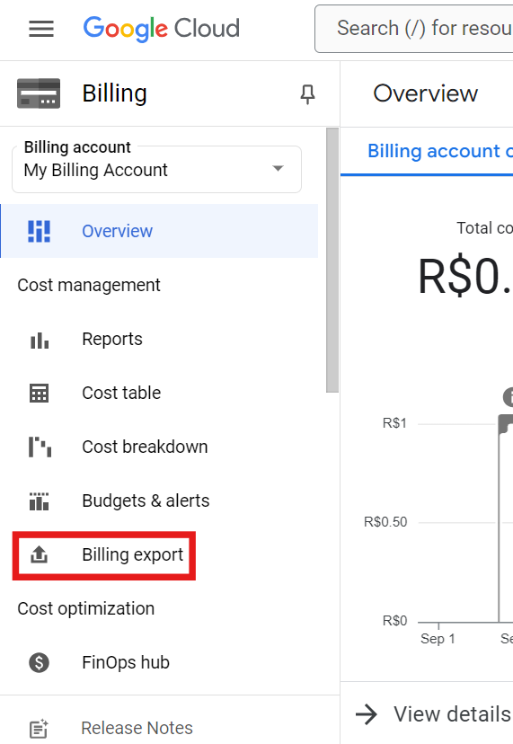
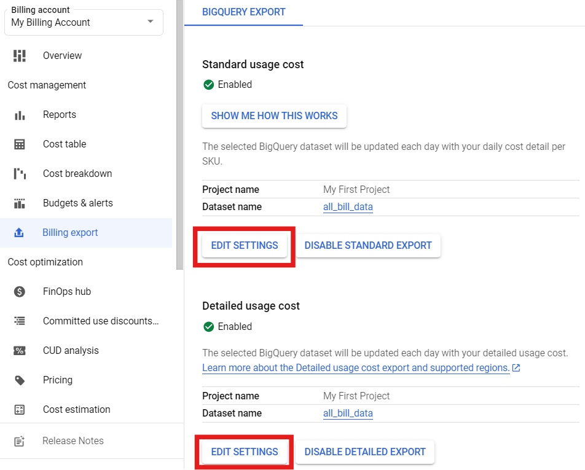
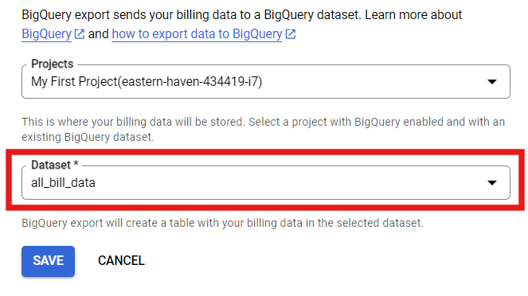
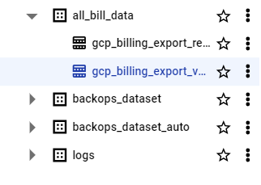
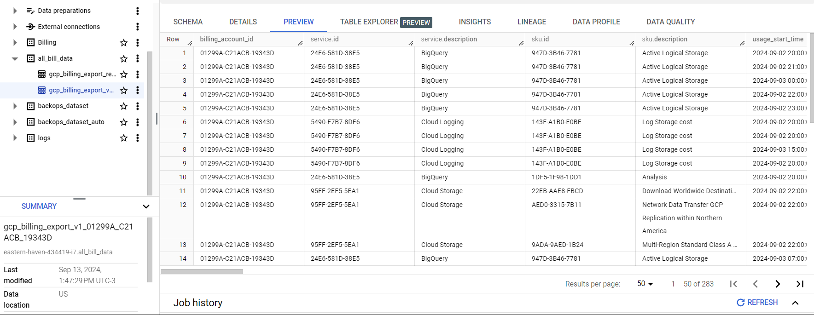

# Billing Export

**Módulos:**  
1. **Definição**
2. **Exportação da fatura**

## Definição

O **Billing Export** no Google Cloud é uma ferramenta que manda seus dados de uso e custos para o **BigQuery** ou **Cloud Storage**. Com isso, você consegue ver de forma mais detalhada como está gastando nos serviços do Google Cloud, criar relatórios personalizados e entender melhor onde está indo o dinheiro em cada projeto ou recurso.

## Exportação da fatura

Uma vez aberto o _Billing_, entramos na aba de **_billing export_**.

Aqui, devemos editar as configurações de **Standard usage cost** e **Detailed usage cost**.

_Obs: No print estão habilitadas pois nosso projeto já está em progresso._

Dentro das configurações podemos escolher tanto o projeto quanto o dataset de destino para a criação da tabela de custo, sendo um dataset já existente ou cria-ló do zero.

_Obs: Em nosso projeto foi criado um dataset chamado **all_bill_data** para melhor visualização dos custos._

Após o procedimento anterior, podemos salvar as altereções e esperar algumas horas até a criação do Dataset e das tabelas particionadas.

O processo de exportação de dados para as tabelas **_gcp_billing_export_** pode demorar entre algumas horas ou até mesmo 24h horas.

