# Looker Studio

**Módulos:**  
1. **Acesse o BigQuery**
2. **Execute uma consulta**
3. **Visualizar Dados no Looker Studio**
4. **Conexão Automática ao Looker Studio**
5. **Criar Visualizações no Looker Studio**
6. **Personalize o Relatório**
7. **Salvar e Compartilhar o Relatório**

## Definição

O Looker Studio (anteriormente conhecido como Google Data Studio) é uma ferramenta gratuita de visualização de dados no Google Cloud que permite criar relatórios e dashboards interativos. 

## Acesse o BigQuery

- Vá até o Google Cloud Console.

- No menu de navegação à esquerda, selecione BigQuery.

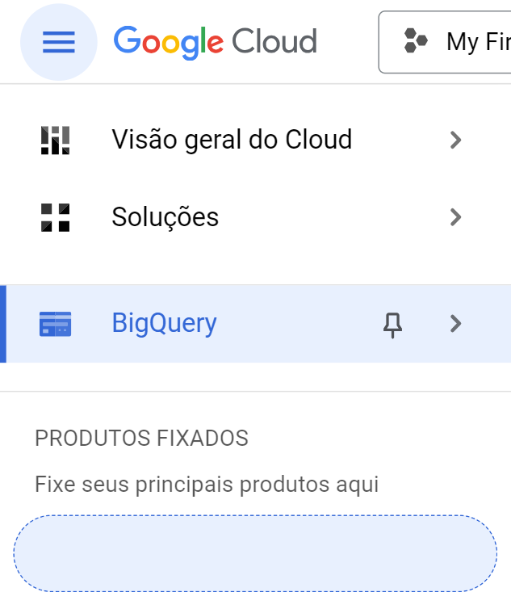

## Execute uma consulta

- No painel do BigQuery, abra o editor de consultas.

- Digite e execute a consulta SQL desejada. Por exemplo:

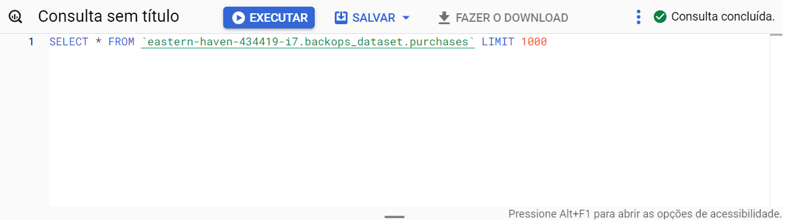

- Clique em "Executar" (Run) para executar a consulta.

## Visualizar Dados no Looker Studio

- No resultado da consulta, logo abaixo da tabela de resultados, clique em "Explorar Dados".

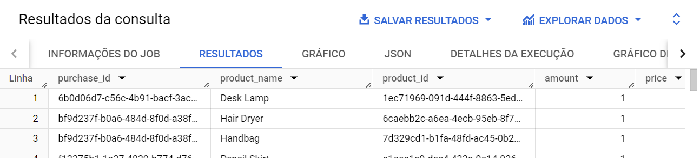

- Selecione a opção "Explorar no Looker Studio".

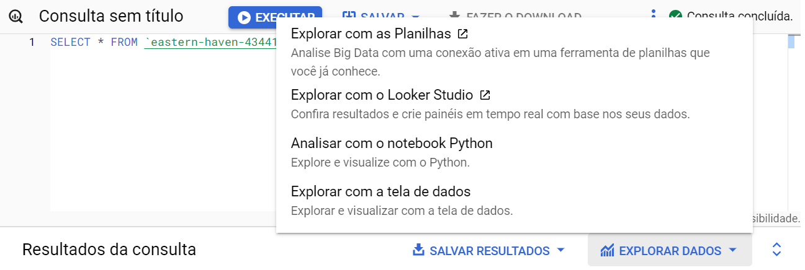

## Conexão Automática ao Looker Studio

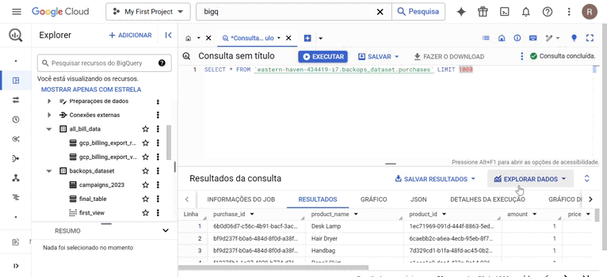

- O Looker Studio será aberto automaticamente em uma nova aba do navegador.

- Os dados que você consultou no BigQuery estarão automaticamente conectados ao Looker Studio como uma nova fonte de dados temporária.

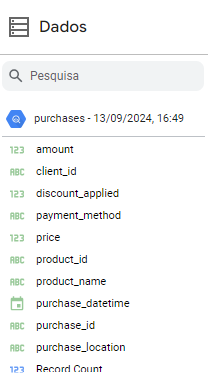

- Agora, você verá uma interface onde poderá criar relatórios e visualizações com base nos dados retornados pela consulta.

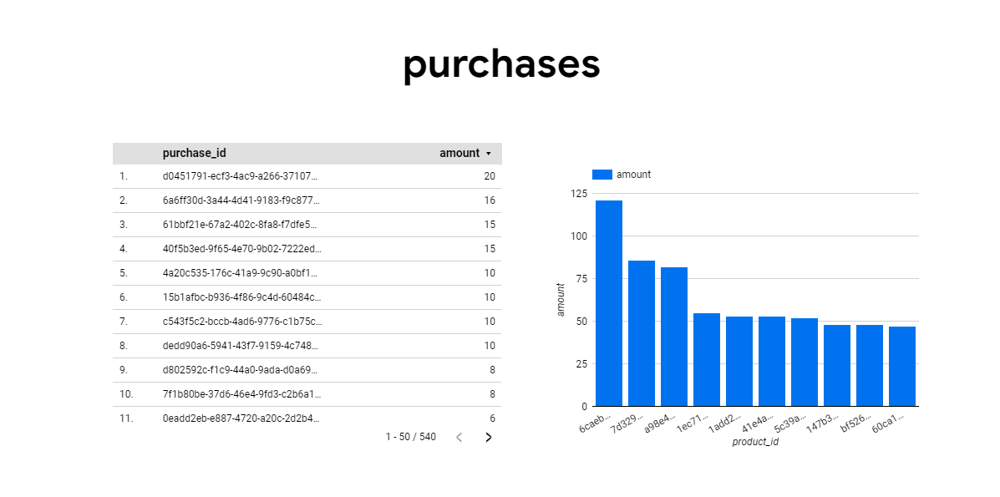

## Criar Visualizações no Looker Studio

- Adicione gráficos ou tabelas para visualizar os dados:

    - Clique em "Adicionar um gráfico" no menu superior e escolha entre gráficos de barra, linha, pizza, etc.

    - Para tabelas, selecione "Tabela" e arraste os campos que deseja exibir.

- Você também pode arrastar e soltar os campos diretamente no relatório para criar novas visualizações.

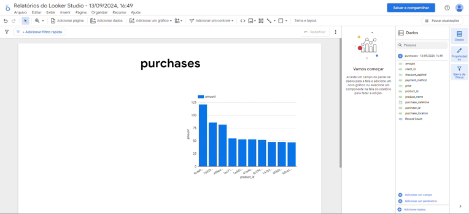

## Personalize o Relatório

- Filtros: Adicione filtros para limitar ou segmentar os dados exibidos. 

    - Vá até o painel lateral e clique em "Filtros".

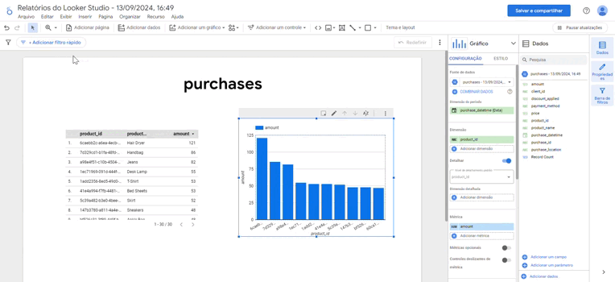

- Estilo: Ajuste cores, fontes, e o layout dos gráficos através da aba de "Estilo" no painel lateral.

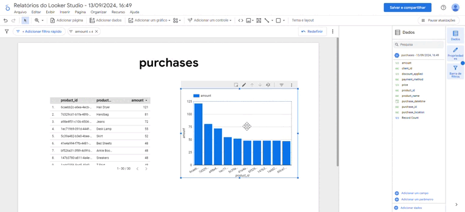

## Salvar e Compartilhar o Relatório

- Quando estiver satisfeito com o relatório, ele será salvo automaticamente no Looker Studio.

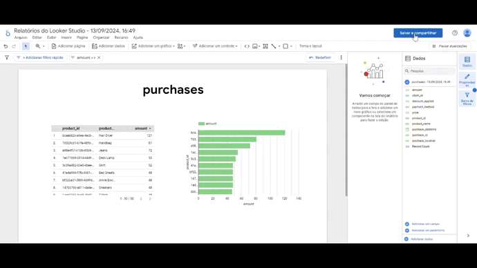

- Você pode exportar o relatório como PDF ou publicá-lo para acesso por link.

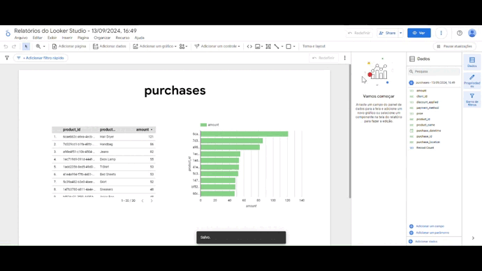