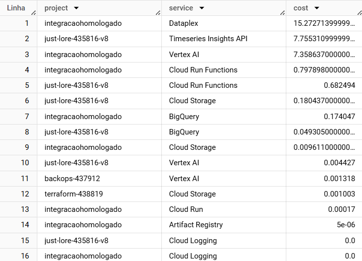
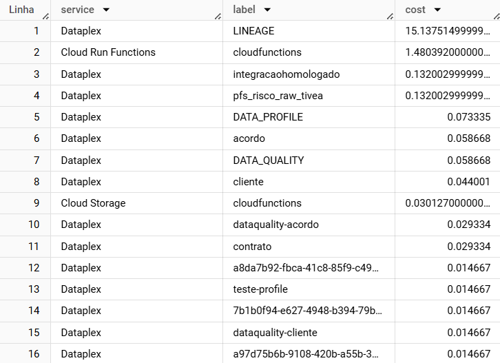
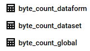
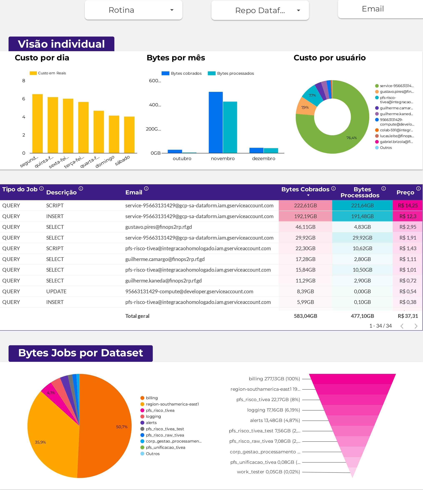

# Páginas do Looker Studio Pernambucanas

**Módulos:**  
1. **Billing**  
2. **Logging**  
3. **Jobs**
  
## Definição

O modelo Pernambucanas no Looker Studio abrange páginas dedicadas ao monitoramento de custos em diversos formatos. Ele detalha o processo de exportação e visualização dos dados.

## Overview

A página **"Overview"** apresenta uma visão geral do custo e da fatura do projeto, incluindo a distribuição do custo por serviço e seu histórico.


### Exportação

Os dados são exportados para o Looker Studio a partir da tabela detalhada de exportação do Cloud Billing (`gcp_billing_export_resource`).

[Referência: Exportação do faturamento](../bigquery/export_billing.md)


Essa tabela contém informações como projeto, serviço e custo de cada cobrança na conta de faturamento. Com isso, é possível categorizar os gráficos por serviço e outros elementos relevantes.



Para uma análise mais detalhada, a coluna **"labels"** pode ser utilizada para explorar o uso de cada serviço.



### Visualização

A partir da exportação, os gráficos de faturamento dos serviços podem ser categorizados pelas **"labels"**.  


---

## Logging

A replicação das telas de dashboards do Cloud Monitoring exige a exportação periódica das métricas, obtida por meio de requisições.


### Exportação

Esse processo é automatizado com uma função no **Cloud Functions**, disparada pelo **Scheduler**.

[Referência: Função de exportação do Cloud Monitoring](../../functions/export_cloud_monitoring.py)

A função cria ou atualiza tabelas para cada métrica monitorada, configurando parâmetros como período, métodos, métrica e filtros na requisição HTTP:

```python
params = {
    "interval.startTime": "2024-10-24T00:00:00.000000Z", 
    "interval.endTime": end_time,  
    "aggregation.alignmentPeriod": "60s",
    "aggregation.perSeriesAligner": "ALIGN_SUM", 
    "aggregation.crossSeriesReducer": "REDUCE_SUM",  
    "filter": 'metric.type="logging.googleapis.com/byte_count" resource.type="global"',
    "aggregation.groupByFields": "metric.labels.key"
}
```



Além disso, para capturar registros detalhados, ativamos o roteador de registros para exportar sem filtros, gerando várias tabelas organizadas por serviço.


### Visualização

As tabelas exportadas permitem a visualização no Looker Studio.


A listagem detalhada dos logs utiliza as tabelas criadas pelo roteador de registros.


## Jobs

### Exportação

Foi necessãrio a exportação dos jobs para uma tabela do BigQuery: [Anotação: Tabela de Jobs](../bigquery/jobs_table.md). Isso possibilitou a criação de gráficos que exibem o custo de processamento e monetário dos jobs categorizados por usuário, data e query.

Adicionalmente, foi fundamental adicionar rótulos personalizados com base nas rotinas do DataForm ([Anotação: Rótulos dos Jobs](../dataform/job_label.md)), permitindo a categorização dos custos tanto pelo repositório do DataForm quanto pela rotina associada.

### Visualização

Diante da tabela criada, podemos filtrar os gráficos criados pelo usuário, rotina e repositório do DataForm.


