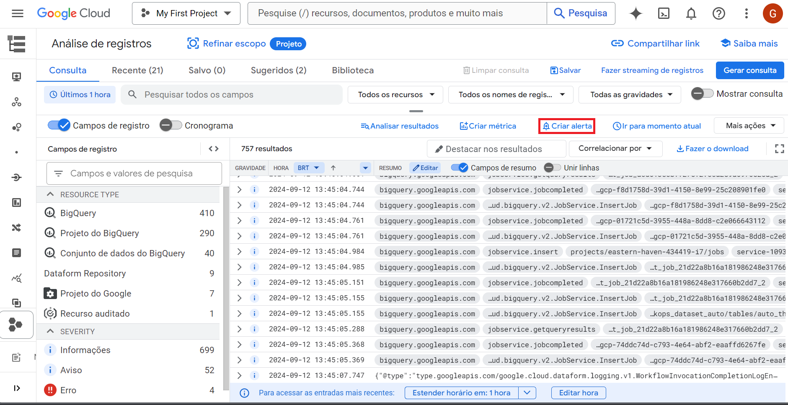
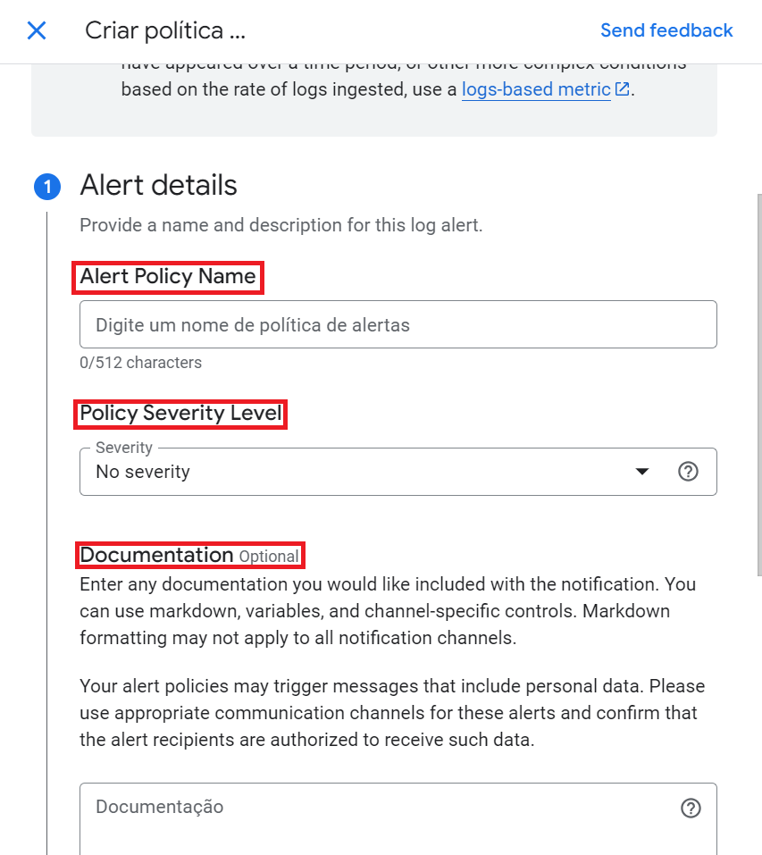
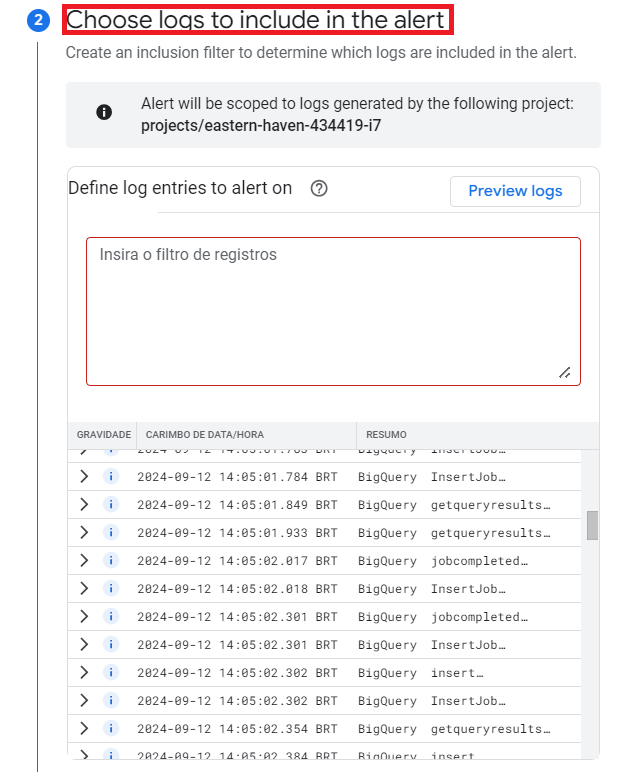
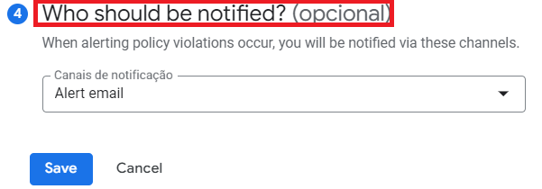
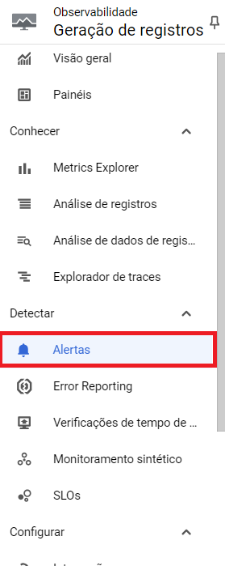
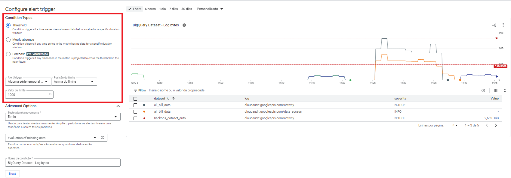
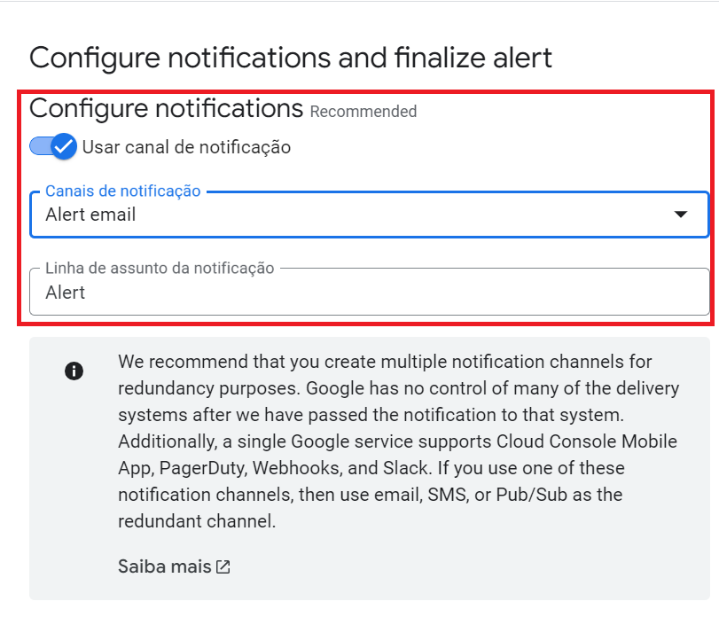
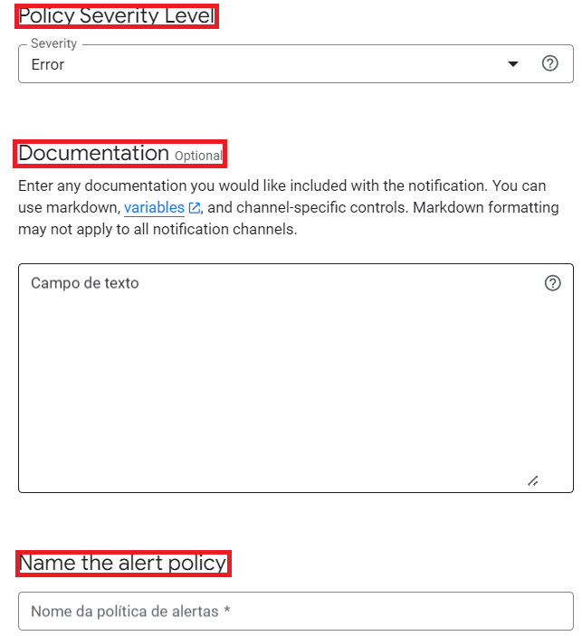

# Alertas

Existem duas maneiras de criar alertas: utilizando **logs** ou criando **métricas**. Abaixo estão os passos para cada método.

## 1. Criação de Alertas com Logs

1. Acesse a **análise de registros**:

   

2. Selecione a opção **Criar alerta**.

3. Uma nova aba lateral será exibida para a criação da política do novo alerta, onde você poderá inserir:
   - Nome do alerta
   - Nível de gravidade
   - Documentação opcional

   

4. Defina os detalhes do alerta e insira as entradas de **logs** que serão monitoradas:

   

5. (Opcional) Adicione **tags** no alerta para fornecer mais informações sobre o log que originou o alerta.

   

6. Selecione o intervalo de tempo entre as notificações e o tempo de duração para o fechamento automático de incidentes:

   

7. Escolha um **canal de notificação** previamente configurado para receber os alertas.

   

8. Por fim, crie o alerta, que enviará notificações de acordo com os logs.

## 2. Criação de Alertas com Métricas

1. Acesse a **análise de registros** e, no menu lateral, selecione a opção **Alertas**:

   

2. Na aba de alertas, selecione a opção **+ Create policy**:

   

3. Uma nova janela de configuração será exibida. Comece definindo a **métrica** desejada para o alerta:

   

4. Após selecionar a métrica, você poderá:
   - Criar **filtros**
   - Definir **séries temporais**
   - Configurar a **função da janela**

   

5. Defina o comportamento do gatilho do alerta, como:
   - Passagem de um limite específico
   - Ausência de dados por um período

   

6. Configure o modo de **notificação** do alerta:

   

7. Defina o intervalo de notificações, insira a documentação e dê um nome para a política:

   

8. Finalmente, revise a métrica e selecione a opção **Criar política**:

   
