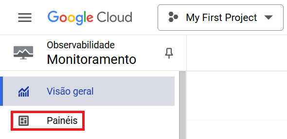
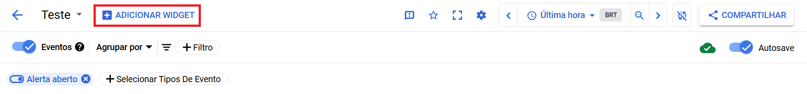
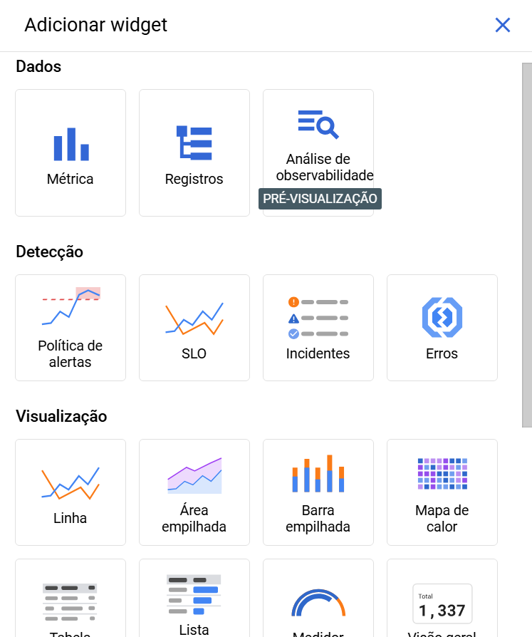
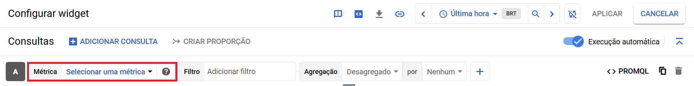
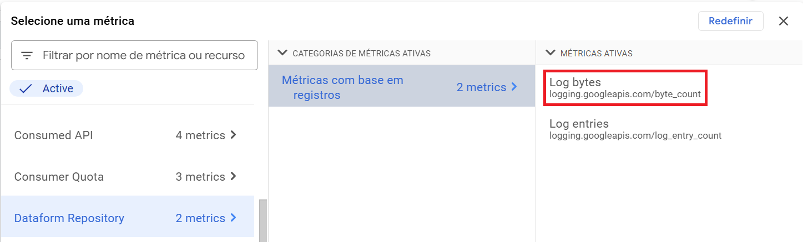
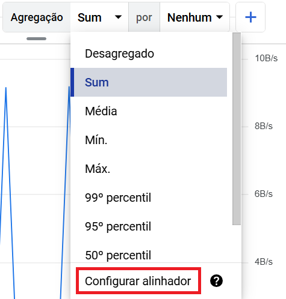
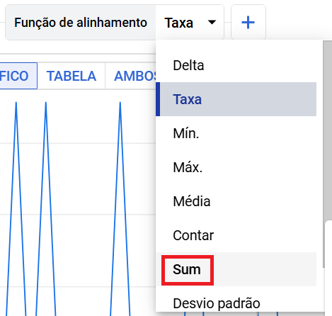
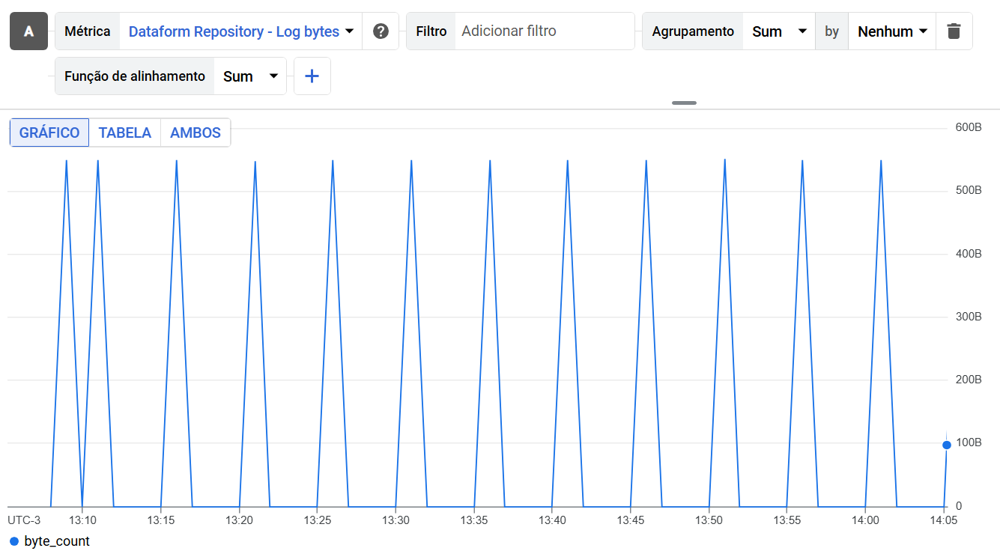
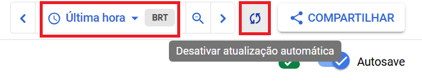

# Monitoramento

**Módulos:**  
1. **Definição**
2. **Criação de Dashboards**
3. **Métricas**
4. **Alinhador** 

## Definição

O Cloud Monitoring indica o desempenho, o tempo de atividade e a integridade geral dos outros serviços a partir de métricas e filtros. Assim, é possível visualizar dados em gráficos e painéis e criar alertas para ser notificado quando as métricas estiverem fora dos intervalos esperados.

## Criação de Dashboards

Uma vez aberto o Monitoramento, entramos na aba de painéis.

Aqui, podemos criar um repositório de painéis.

Quando criado, é possível editar o nome do repositório.

Agora adicionaremos um painel.

Nele, podemos escolher qual será o tipo de gráfico. Em nosso caso, escolheremos o gráfico de linha.

## Métricas

Feito isso, podemos configurar o gráfico através de métricas.

Em nosso caso, usaremos a métrica de bytes dos logs do DataForm, para medir quanto a nossa rotina está gastando de processamento.

## Alinhador

Por padrão, essa métrica retorna os bytes por segundo (B/s), mesmo na agregação Sum. Porém, queremos a soma absoluta dos bytes, assim, configuraremos o alinhador.

No alinhador, selecionaremos a função Sum.

Pronto, criamos um gráfico que monitora o gasto de processamento (Byte) da nossa rotina.

Lembre-se de alterar o intervalo de tempo e ativar a atualização automática do repositório para uma melhor visualização.

