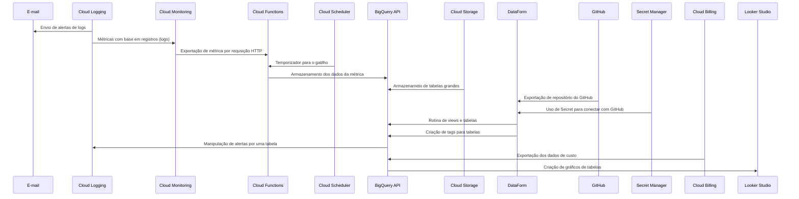

# **Diagrama de sequência**:

```mermaid
sequenceDiagram
    participant E as E-mail
    participant CL as Cloud Logging
    participant CM as Cloud Monitoring
    participant CF as Cloud Functions
    participant CS as Cloud Scheduler
    participant BQ as BigQuery API
    participant CST as Cloud Storage
    participant DF as DataForm
    participant GH as GitHub
    participant SM as Secret Manager
    participant CB as Cloud Billing
    participant LS as Looker Studio

    CL->>E: Envio de alertas de logs
    CL->>CM: Métricas com base em registros (logs)
    CM->>CF: Exportação de métrica por requsição HTTP
    CS->>CF: Temporizador para o gatilho
    CF->>BQ: Armazenamento dos dados da métrica
    CST->>BQ: Armazenameto de tabelas grandes
    GH->>DF: Exportação de repositório do GitHub
    SM->>DF: Uso de Secret para conectar com GitHub
    DF->>BQ: Rotina de views e tabelas
    DF->>BQ: Criação de tags para tabelas
    BQ->>CL: Manipulação de alertas por uma tabela
    CB->>BQ: Exportação dos dados de custo
    BQ->>LS: Criação de gráficos de tabelas
```