# Fluxo de trabalho

**Módulos:**  
- Cloud Monitoring
- Faturamento
- Alertamento
- Jobs

## :mag_right: Cloud Monitoring 

O Cloud Logging processa dados de registro (logs) para visualizar o desempenho, o tempo de atividade e a integridade geral dos aplicativos e APIs. 

A categorização desses insights ocorre por meio de filtros ou métricas dos registros.

[Anotação: Cloud Monitoring](annotations/monitoring/monitoring.md)

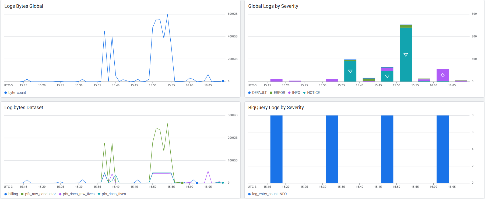

Os painéis criados são agrupados em dashboards, assim, reunimos-os conforme os dados a serem visualizados.

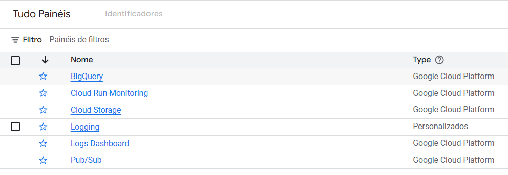

### Exportação dos dados

Apesar da boa interpretação do Cloud Monitoring, é considerável a exportação de seus insights para o BigQuery, tanto para um armazenamento a longo prazo, quanto para sua utilização no Looker Studio.

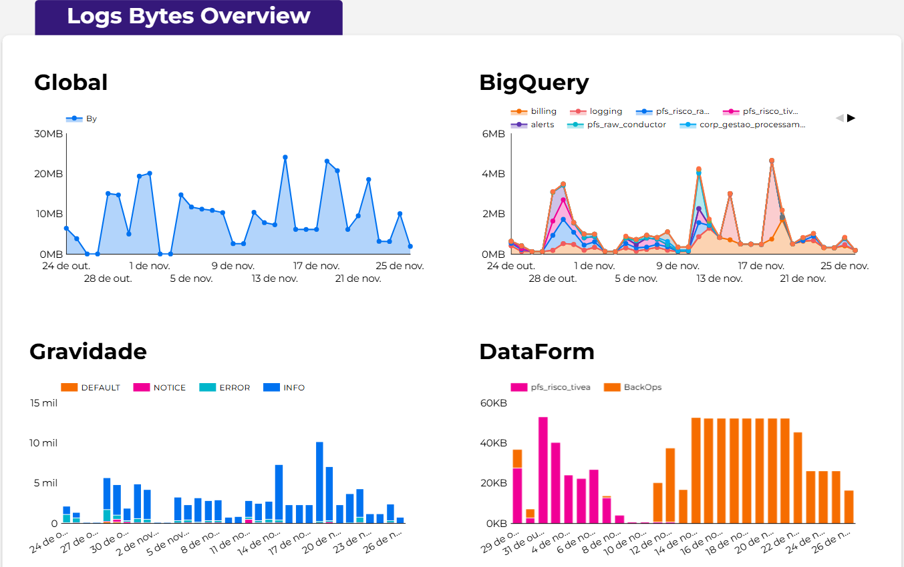

Nesse contexto, adicionamos uma função no Cloud Functions para a exportação dos registro periodicamente a uma tabela do BigQuery.

[Função de exportação Cloud Monitoring](functions/export_cloud_monitoring.py)

### Roteador de registros

O roteador de registros pode ser usado para rotear determinadas entradas de registro para destinos em um projeto. Em nosso caso, exportamos os registros para um dataset do BigQuery, sem nenhum filtro. 

Assim, diversas tabelas são criadas de acordo com o recurso dos registros.

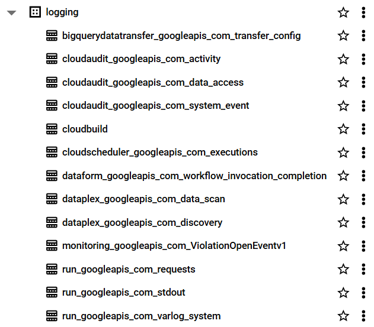

À partir disso, é possível criar uma visualização direta e interativa no Looker Studio.

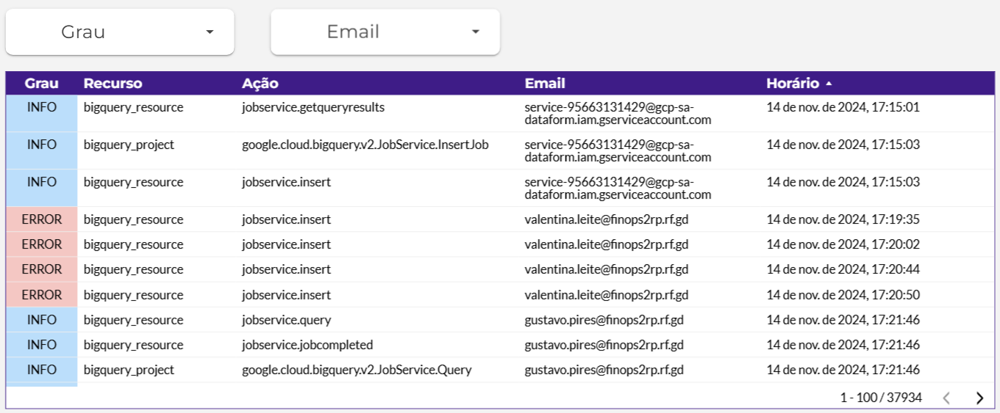

## :moneybag: Faturamento

O Cloud Billing é um serviço que ajuda a rastrear e entender seus gastos em um projeto. 

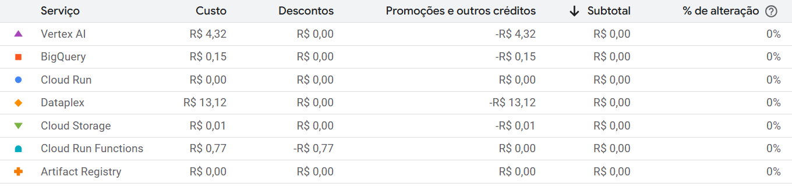

A exportação do Cloud Billing para o BigQuery permite exportar dados detalhados ao longo do dia. 

[Anotação: Exportação do faturamento](annotations/bigquery/export_billing.md)

Estes são os seguintes tipos de dados que podem ser ativados para exportação:

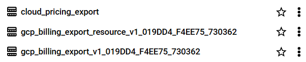

Utilizamos comumente a tabela de exportação detalhada (gcp_billing_export_resource) para analisar os custos no nível do recurso e identificar serviços em específico. Em seguida, acessamos os dados exportados para análise detalhada através de scripts, ou exportamos os dados ao Looker Studio para uma visualização interativa. 

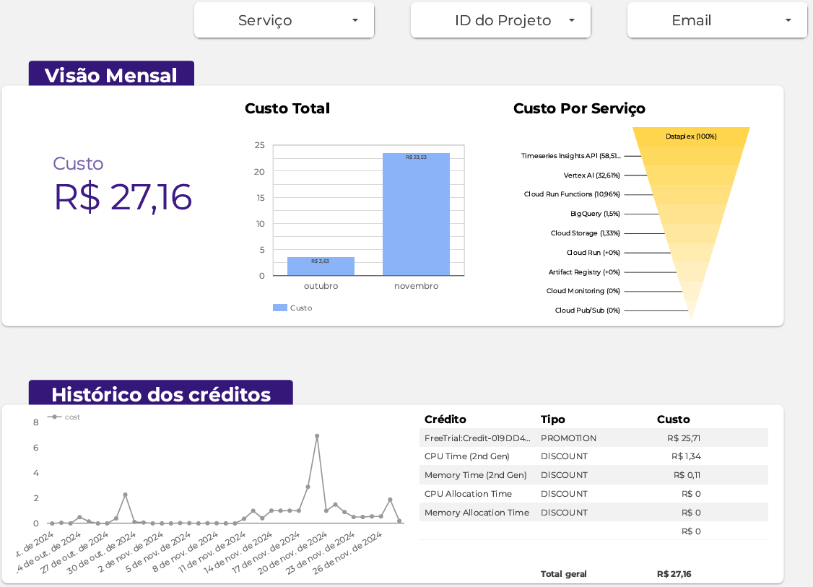

Além disso, com os custos categorizados por recurso, é possível filtrar pelos serviços de cada um. Em uma de nossas páginas, dedicamos para expor os recursos mais custosos do projeto.

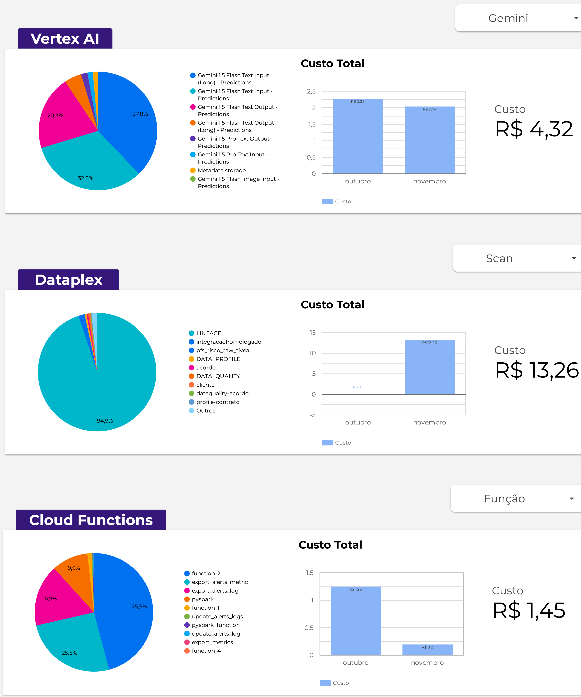

## :rotating_light: Alertamento

Os alertas no Google Cloud são ferramentas de monitoramento que notificam automaticamente sobre eventos críticos em serviços e APIs. 

Além disso, a personalização do período de notificação e dos destinatários garante que os alertas sejam entregues aos canais preferenciais. Eles podem ser configurados com base em métricas, logs e eventos personalizados.

[Anotação: Alertas](annotations/alerts/alert.md)

### Alertas por logs

Os alertas baseados em logs são fáceis de configurar e monitoram eventos específicos a partir dos registros. A funcionalidade permite a personalização de atributos importantes, como nome do alerta, nível de gravidade e documentação.

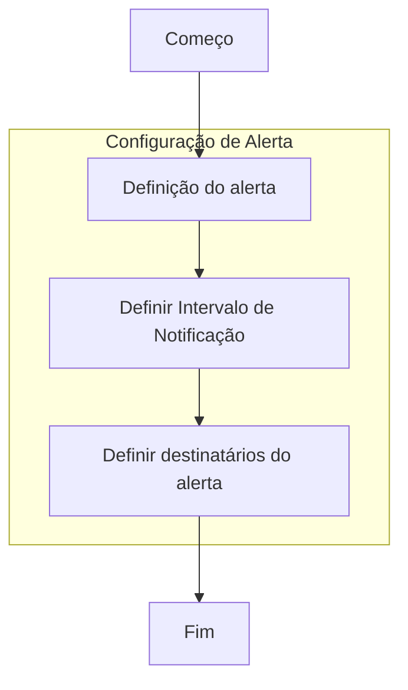

### Alertas por métricas

Os alertas por métricas utilizam valores numéricos para monitorar o comportamento de recursos e, com base em condições definidas, acionam notificações quando um determinado limiar é atingido. 

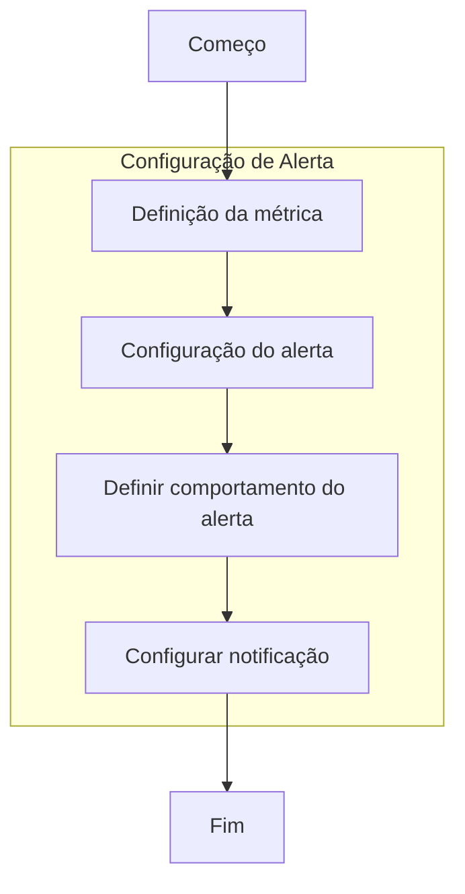

### Alertas por Cloud Shell

Além da definição manual, os alertas podem ser criados pelo terminal do Cloud Shell. A maneira é configurar os campos desejados na interface de criação de alertas e, em seguida, exportar a configuração como um arquivo JSON. Esse arquivo pode ser executado no terminal via comandos específicos.

[Anotação: Alertas por Cloud Shell](annotations/alerts/alert_shell.md)

### Alertas por custo de serviços

Os alertas de custos permitem monitorar o faturamento de uma conta e enviar notificações automáticas quando os custos atingem percentuais pré-definidos.. Essa configuração ajuda a monitorar os custos acumulados de serviços específicos e a evitar estouros de orçamento.

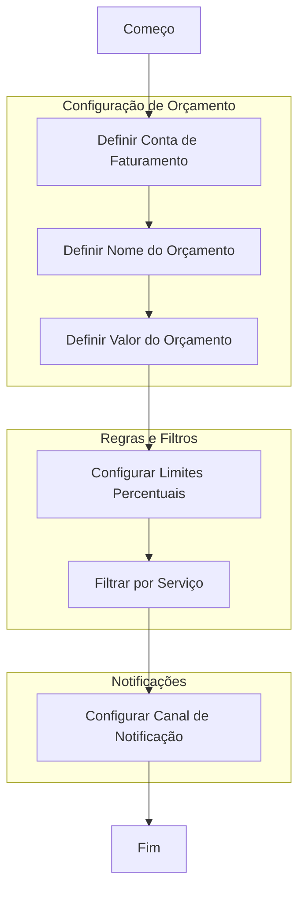

[Anotação: Alertas por custo de serviços](annotations/alerts/alert_services.md)

### Tabelas de alertas

Para automatizar a criação, modificação e remoção de alertas, decidimos criar duas tabelas a fim de armazenar os detalhes de cada um.

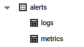

**Alertas de registros (Logs):**

[Função da tabela de alertas por log](functions/Alerts_tables/alerts_logs.py)

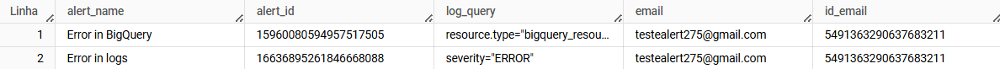

**Alertas de métricas:**

[Função da tabela de alertas por métrica](functions/Alerts_tables/alerts_metrics.py)

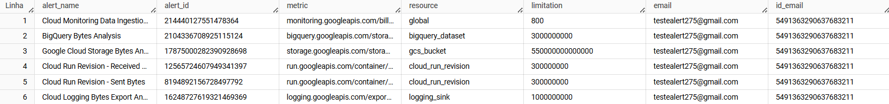

Ou seja, a partir das informações da tabela, a cada inserção, uma função do Cloud Fucntions será executada, recriando cada alerta e excluindo sua cópia. Portanto, toda modificação feita em um determinado alerta da tabela, será feita no real, presente no projeto.

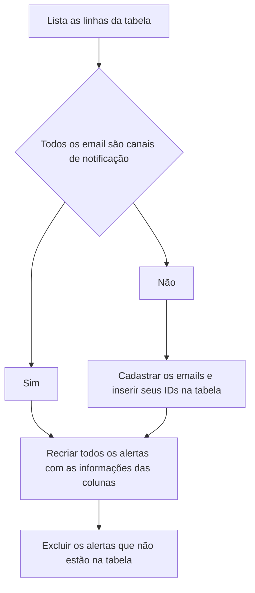

## :briefcase: Jobs

Toda manipulação no BigQuery gera um Job, como a inserção, remoção e seleção em uma tabela (InsertJob). Assim, é ideal a criação de uma tabela para a análise de seu custo de processamento e monetário, bem como categorização por diversos fatores.

Isso é possível com a exportação dos dados da tabela nativa `JOBS_BY_PROJECT` do dataset `INFORMATION_SCHEMA`. Além disso, é preciso a criação de colunas de preço e rótulos de cada Job, para a visualização de seu custo.

[Anotação: Exportação dos Jobs](annotations/bigquery/jobs_table.md)

```sql
CREATE OR REPLACE TABLE *tabela*
PARTITION BY DATE(creation_time) AS
SELECT *,
  (total_bytes_billed / POW(10, 12)) * 64 AS price,
  (SELECT value FROM UNNEST(labels) WHERE key = 'dataform_repository_id') AS dataform_repository,
  (SELECT parent_label.value 
   FROM region-southamerica-east1.INFORMATION_SCHEMA.JOBS_BY_PROJECT AS parent
   CROSS JOIN UNNEST(parent.labels) AS parent_label
   WHERE parent.parent_job_id = jobs.job_id AND parent_label.key = 'routine') AS routine
FROM *region*.INFORMATION_SCHEMA.JOBS_BY_PROJECT AS jobs
WHERE total_bytes_billed > 0;
```

Isso possibilita a criação de gráficos e painéis personalizavéis no Looker Studio, categorizando e dividindo os dados por qualquer coluna ou rótulo do Job.

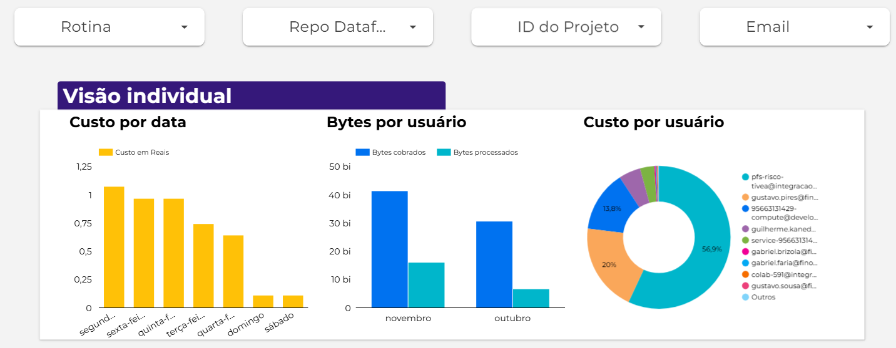

Por fim, para automatizar a atualização da tabela, adicionamos a query em um repositório do DataForm, com o `type: incremental` no config do SQLX.

### Rotina do DataForm

Uma das importantes caracteristicas de um Job do DataForm é a rotina a qual executou-o. Para especifica-la na tabela criada, devemos adicionar um rótulo personalizado no Job através da função `@@query_label` no arquivo SQLX da query.

Porém, é necessário a transcrição do rótulo do Job para seu `parent_job`, já que esse possui o real custo de processamento de cada script da rotina.

[Anotação: Rótulo de jobs](annotations/bigquery/job_label.md)

Para isso, como abordado na anotação acima, a subsconsulta referente a essa coluna é:

```sql
SELECT parent_label.value 
FROM region-southamerica-east1.INFORMATION_SCHEMA.JOBS_BY_PROJECT AS parent
CROSS JOIN UNNEST(parent.labels) AS parent_label
WHERE parent.parent_job_id = jobs.job_id AND parent_label.key = 'routine'
```

Nesse contexto, é possível criar um filtro pela métrica da rotina do DataForm no Looker Studio, filtrando o custo e uso dos jobs por essa métrica.

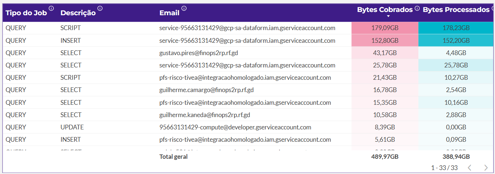